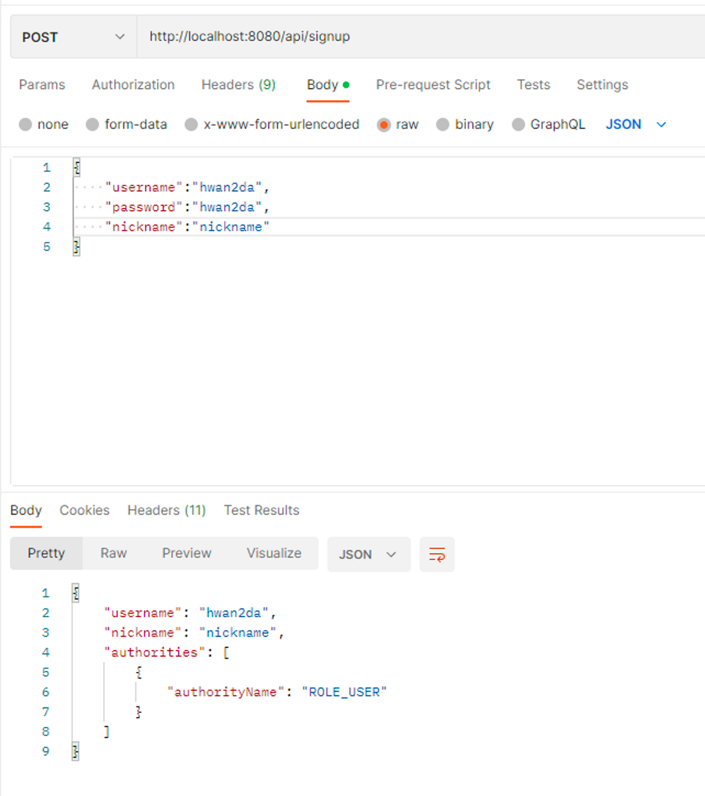
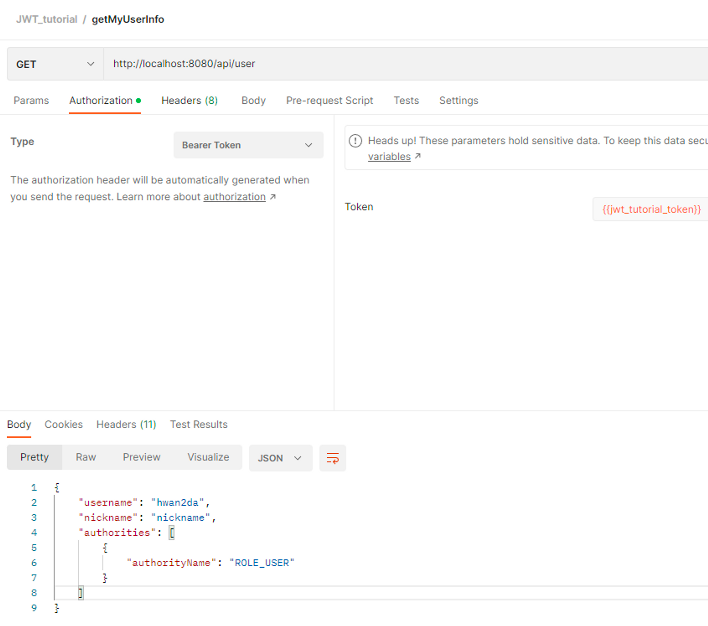
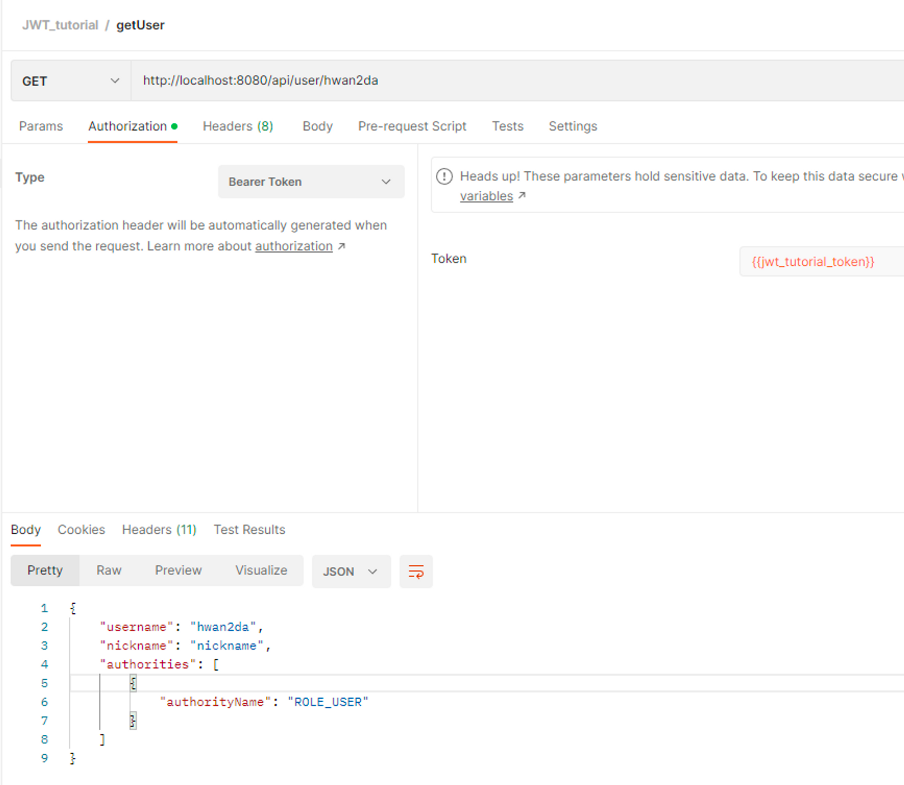

## 회원가입, 권한검증

- 회원가입 , 권한검증
    - ### SecurityUtil
        - `getCurrentUsername()`
            - Security Context의 Authentication 객체를 이용해 username을 리턴해주는 유틸성 메소드
            - Security Context 에 Authentication  객체가 저장되는 시점은 JwtFilter의 doFilter메소드에서 요청이 들어올 때이다.
    - ### UserService
        - `signUp(SignUpDto signUpDto)`
            - DB에 이미 있는 지 체크해서 없다면 권한 정보를 만든다. 유저 정보를 생성하고 userRepository의 save를 통해 DB에 정보를 저장한다. 권한 정보에 따라 권한검증 테스트 실시
        - 유저 , 권한정보를 가져오는 두 가지 메소드
            - username을 기준으로 정보를 가져온다

                ```java
                @Transactional(readOnly = true)
                public Optional<User> getUserWithAuthorities(String username) {
                    return userRepository.findOneWithAuthoritiesByUserName(username);
                }
                ```

            - SecurityContext에 저장된 username의 정보만 가져온다.

                ```java
                @Transactional(readOnly = true)
                public Optional<User> getMyUserWithAuthorities() {
                    return SecurityUtil.getCurrentUsername().flatMap(userRepository::findOneWithAuthoritiesByUserName);
                }
                ```

    - ### UserController
        - singup api ( 회원가입 )

          

        - getMyUserInfo ( 내 정보 조회 )
            - `@PreAuthorize("hasAnyRole('USER','ADMIN')")` 애노테이션을 이용해서 유저와 관리자 두 가지 권한 모두 허용함

              

        - getUserInfo ( 회원 정보 조회 )
            - `@PreAuthorize("hasAnyRole('ADMIN')")` 애노테이션을 이용해서 관리자만 허용한다.
                - 관리자 권한이 없다면 403 액세스 디나이 에러가 발생한다.

                  